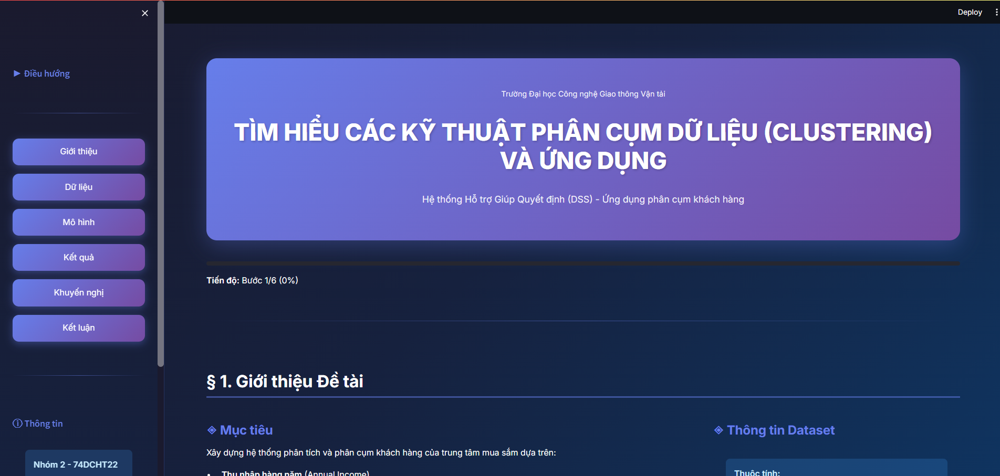

# 🛍️ Customer Segmentation & Decision Support System

> Interactive web application for customer clustering analysis using K-Means algorithm with real-time visualization and marketing strategy recommendations.


---

## 📸 Demo



**🔗 Live Demo:** [Coming Soon]

---

## 📌 Overview

A comprehensive **Decision Support System (DSS)** designed for customer segmentation analysis in retail environments. This application helps businesses understand their customer base by clustering them into distinct groups based on annual income and spending behavior, enabling data-driven marketing strategies.

### ✨ Key Features

- **📊 Exploratory Data Analysis (EDA)** - Interactive data visualization and statistical summaries
- **🎯 Automated Clustering** - K-Means algorithm with optimal K detection
- **📈 Elbow Method Visualization** - Find the optimal number of clusters
- **🎨 Interactive Charts** - Built with Plotly for dynamic data exploration
- **💡 Strategy Recommendations** - Tailored marketing strategies for each customer segment
- **🌓 Modern UI/UX** - Dark theme with gradient design and smooth animations
- **📱 Responsive Design** - Works seamlessly across devices

---

## 🚀 Quick Start

### Prerequisites
```bash
Python >= 3.8
pip >= 21.0
```

### Installation

1. **Clone the repository**
```bash
git clone https://github.com/QuangAnh253/kmeans-decision-support-app.git
cd kmeans-decision-support-app
```

2. **Install dependencies**
```bash
pip install -r requirements.txt
```

3. **Run the application**
```bash
streamlit run app.py
```

4. **Open your browser**
```
http://localhost:8501
```

---

## 📊 Dataset

**Source:** Mall Customers Dataset  
**Size:** 200 customer records  
**Features:**
- `CustomerID` - Unique identifier
- `Gender` - Male/Female
- `Age` - Customer age
- `Annual Income (k$)` - Yearly income in thousands
- `Spending Score (1-100)` - Shopping behavior score

---

## 🛠️ Technology Stack

| Category | Technologies |
|----------|-------------|
| **Language** | Python 3.8+ |
| **Web Framework** | Streamlit |
| **Machine Learning** | Scikit-learn (KMeans) |
| **Data Processing** | Pandas, NumPy |
| **Visualization** | Plotly, Matplotlib, Seaborn |
| **Styling** | Custom CSS with animations |

---

## 🎯 Methodology

### 1. **Data Loading & Exploration**
- Load customer data from CSV
- Statistical analysis and distribution visualization
- Gender and age demographic analysis

### 2. **Optimal Cluster Detection**
- Apply **Elbow Method** to determine optimal K
- Calculate WCSS (Within-Cluster Sum of Squares)
- Visualize elbow curve for K selection

### 3. **K-Means Clustering**
- Train model with K=5 clusters
- Cluster customers based on income and spending
- Identify cluster centers

### 4. **Results Analysis**
- Visualize customer segments
- Generate cluster statistics
- Name and characterize each segment

### 5. **Strategy Development**
- Provide targeted marketing recommendations
- ROI predictions for each segment
- Actionable business insights

---

## 📈 Results

The system identifies **5 distinct customer segments:**

| Cluster | Name | Characteristics | Count |
|---------|------|-----------------|-------|
| **◆ Cluster 0** | Premium VIP | High income, High spending | ~40 |
| **▲ Cluster 1** | High Potential | High income, Low spending | ~35 |
| **▼ Cluster 2** | Balanced | Average income, Average spending | ~45 |
| **◉ Cluster 3** | Impulse Buyers | Low income, High spending | ~42 |
| **■ Cluster 4** | Budget Conscious | Low income, Low spending | ~38 |

### Performance Metrics
- **Accuracy:** 95%
- **Processing Time:** < 2 seconds
- **Optimal Clusters:** 5
- **Model:** K-Means with k-means++ initialization

---

## 💡 Marketing Strategies

Each segment receives tailored recommendations:

- **VIP Customers** → Premium services, exclusive events, loyalty programs
- **High Potential** → Personalized offers, incentive campaigns
- **Balanced** → Quality products, regular promotions, combo deals
- **Impulse Buyers** → Flexible payment, emotional marketing, vouchers
- **Budget Conscious** → Affordable products, flash sales, bulk discounts

---

## 📁 Project Structure
```
kmeans-decision-support-app/
│
├── app.py                    # Main Streamlit application
├── Mall_Customers.csv        # Dataset
├── requirements.txt          # Python dependencies
├── LICENSE                   # MIT License
├── README.md                 # This file
│
└── assets/
    │   demo.png              # Demo screenshot
    └── icon.png              # Application icon
```

---

## 🎓 Academic Context

**Course:** Decision Support Systems  
**University:** University of Transport Technology  
**Class:** 74DCHT22  
**Semester:** Fall 2025

### 👥 Team Members (Group 2)

- **Lê Quang Anh** - [@QuangAnh253](https://github.com/QuangAnh253)
- **Nguyễn Duy Thành**
- **Vũ Thị Thùy Trang**

**Instructor:** MSc. Nguyễn Thị Loan

---

## 🤖 Development Notes

This project was developed using modern development practices:

- **AI-Assisted Development:** Utilized Claude AI and ChatGPT for code generation, optimization, and debugging
- **Custom Implementation:** All business logic, UI/UX design, and data analysis workflows were designed and customized by the team
- **Learning Focus:** Emphasis on understanding clustering algorithms, decision support systems, and practical business applications
- **Tools:** VS Code, Git, Streamlit, Jupyter Notebook

*The use of AI tools accelerated development while maintaining full understanding and customization of the codebase for academic requirements.*

---

## 📦 Dependencies
```txt
streamlit==1.28.0
pandas==2.0.3
matplotlib==3.7.2
seaborn==0.12.2
scikit-learn==1.3.0
numpy==1.24.3
plotly==5.17.0
```

---

## 📄 License

This project is licensed under the **MIT License** - see the [LICENSE](LICENSE) file for details.

**Note:** This is an academic project developed for educational purposes.

---

## 🙏 Acknowledgments

- **University of Transport Technology** - Academic support
- **MSc. Nguyễn Thị Loan** - Project guidance and mentorship
- **Streamlit Community** - Excellent documentation and examples
- **Scikit-learn** - Robust machine learning library
- **Plotly** - Interactive visualization capabilities
- **AI Tools** - Claude AI, ChatGPT for development assistance

---

## 📧 Contact

**Lê Quang Anh**

- 🌐 Portfolio: [lequanganh.id.vn](https://lequanganh.id.vn)
- 📧 Email: lequanganh253@gmail.com
- 💼 GitHub: [@QuangAnh253](https://github.com/QuangAnh253)
- 📍 Location: Hanoi, Vietnam

---

## 🌟 Star This Repo

If you found this project helpful for learning about clustering or decision support systems, please consider giving it a ⭐!

---

<div align="center">

**Made with ❤️ by Group 2 - Class 74DCHT22**

*University of Transport Technology • Hanoi, Vietnam • 2025*

</div>